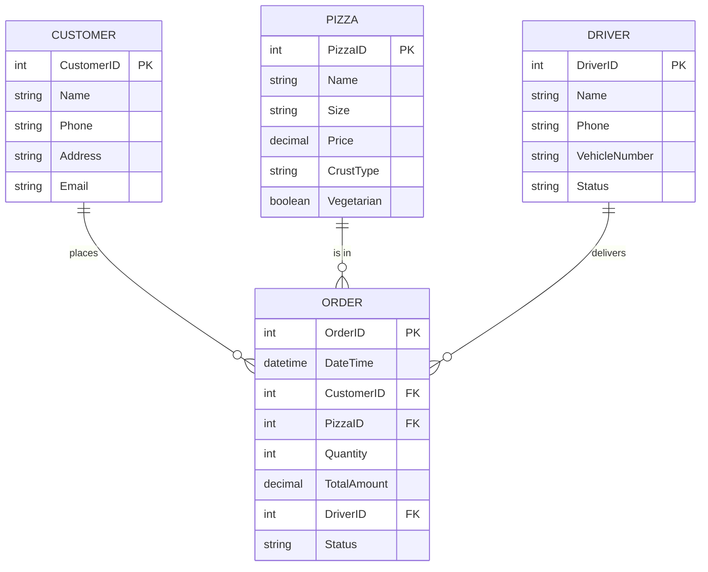

```mermaid
erDiagram
    CUSTOMER ||--o{ ORDER : places
    PIZZA ||--o{ ORDER : "is in"
    DRIVER ||--o{ ORDER : delivers
    
    CUSTOMER {
        int CustomerID PK
        string Name
        string Phone
        string Address
        string Email
    }
    
    PIZZA {
        int PizzaID PK
        string Name
        string Size
        decimal Price
        string CrustType
        boolean Vegetarian
    }
    
    ORDER {
        int OrderID PK
        datetime DateTime
        int CustomerID FK
        int PizzaID FK
        int Quantity
        decimal TotalAmount
        int DriverID FK
        string Status
    }
    
    DRIVER {
        int DriverID PK
        string Name
        string Phone
        string VehicleNumber
        string Status
    }
```
