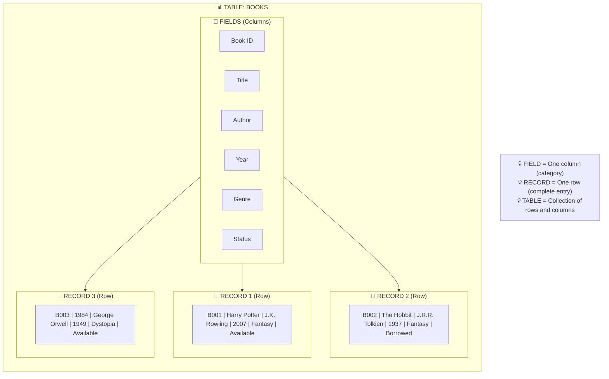

```mermaid
graph TB
    subgraph TABLE["📊 TABLE: BOOKS"]
        direction TB
        
        subgraph FIELDS["📌 FIELDS (Columns)"]
            direction LR
            F1["Book ID"]
            F2["Title"]
            F3["Author"]
            F4["Year"]
            F5["Genre"]
            F6["Status"]
        end
        
        subgraph RECORD1["📝 RECORD 1 (Row)"]
            R1["B001 | Harry Potter | J.K. Rowling | 2007 | Fantasy | Available"]
        end
        
        subgraph RECORD2["📝 RECORD 2 (Row)"]
            R2["B002 | The Hobbit | J.R.R. Tolkien | 1937 | Fantasy | Borrowed"]
        end
        
        subgraph RECORD3["📝 RECORD 3 (Row)"]
            R3["B003 | 1984 | George Orwell | 1949 | Dystopia | Available"]
        end
        
    end
    
    FIELDS --> RECORD1
    FIELDS --> RECORD2
    FIELDS --> RECORD3
    
    NOTE1["💡 FIELD = One column (category)<br/>💡 RECORD = One row (complete entry)<br/>💡 TABLE = Collection of rows and columns"]
```
