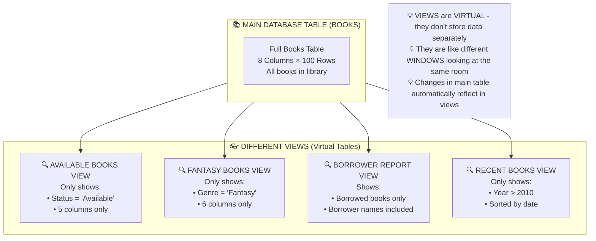

```mermaid
graph TB
    subgraph MAIN["📚 MAIN DATABASE TABLE (BOOKS)"]
        direction TB
        M1["Full Books Table<br/>8 Columns × 100 Rows<br/>All books in library"]
    end
    
    subgraph VIEWS["👓 DIFFERENT VIEWS (Virtual Tables)"]
        direction LR
        
        V1["🔍 AVAILABLE BOOKS VIEW<br/>Only shows:<br/>• Status = 'Available'<br/>• 5 columns only"]
        
        V2["🔍 FANTASY BOOKS VIEW<br/>Only shows:<br/>• Genre = 'Fantasy'<br/>• 6 columns only"]
        
        V3["🔍 BORROWER REPORT VIEW<br/>Shows:<br/>• Borrowed books only<br/>• Borrower names included"]
        
        V4["🔍 RECENT BOOKS VIEW<br/>Only shows:<br/>• Year > 2010<br/>• Sorted by date"]
    end
    
    MAIN --> V1
    MAIN --> V2
    MAIN --> V3
    MAIN --> V4
    
    NOTE["💡 VIEWS are VIRTUAL - they don't store data separately<br/>💡 They are like different WINDOWS looking at the same room<br/>💡 Changes in main table automatically reflect in views"]
```
