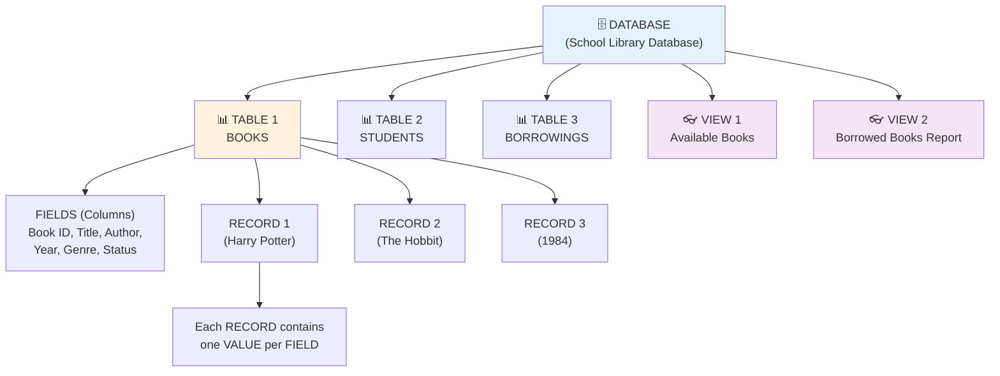

```mermaid
graph TD
    DB["🗄️ DATABASE<br/>(School Library Database)"]
    
    DB --> T1["📊 TABLE 1<br/>BOOKS"]
    DB --> T2["📊 TABLE 2<br/>STUDENTS"]
    DB --> T3["📊 TABLE 3<br/>BORROWINGS"]
    
    T1 --> F1["FIELDS (Columns)<br/>Book ID, Title, Author,<br/>Year, Genre, Status"]
    T1 --> R1["RECORD 1<br/>(Harry Potter)"]
    T1 --> R2["RECORD 2<br/>(The Hobbit)"]
    T1 --> R3["RECORD 3<br/>(1984)"]
    
    R1 --> V1["Each RECORD contains<br/>one VALUE per FIELD"]
    
    DB --> VW1["👓 VIEW 1<br/>Available Books"]
    DB --> VW2["👓 VIEW 2<br/>Borrowed Books Report"]
    
    style DB fill:#e3f2fd
    style T1 fill:#fff3e0
    style VW1 fill:#f3e5f5
    style VW2 fill:#f3e5f5
```
